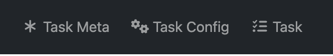

# superScaleZadanieNovak

This application was generated using JHipster 8.8.0, you can find documentation and help at [https://www.jhipster.tech/documentation-archive/v8.8.0](https://www.jhipster.tech/documentation-archive/v8.8.0).

## Project Structure

## Development

The build system will install automatically the recommended version of Node and npm.

We provide a wrapper to launch npm.
You will only need to run this command when dependencies change in [package.json](package.json).

```
./npm install
```

Run the following command to run and create a blissful development experience where your browser
auto-refreshes when files change on your hard drive.

```
./npm start
```

The `./npm run` command will list all the scripts available to run for this project.

## READ! Assignment setup

Use the menu items



If you want to extend/modify the configuration of object metadata, you have to configure it _per_ Task Type in **Task Config** page

The specific metadata is then set up in **Task Meta** page

For the sake of assignment, the initial metadata config is mocked in service - you will lose your changes after browser refresh

If you want to extend the Task Type, you have to extend the enum **`TaskType`** in [task-type.model.ts](src/main/webapp/app/entities/enumerations/task-type.model.ts)

If you want to support more data types, extend enum `TaskFieldType` in [task-field-type.model.ts](src/main/webapp/app/entities/enumerations/task-field-type.model.ts) and adjust the templates accordingly 


## Testing

### Client tests

Unit tests are run by [Jest][]. They're located in [src/test/javascript/](src/test/javascript/) and can be run with:

```
./npm test
```

UI end-to-end tests are powered by [Cypress][]. They're located in [src/test/javascript/cypress](src/test/javascript/cypress)
and can be run by starting Spring Boot in one terminal (`./mvnw spring-boot:run`) and running the tests (`./npmw run e2e`) in a second one.

#### Lighthouse audits

You can execute automated [Lighthouse audits](https://developers.google.com/web/tools/lighthouse/) with [cypress-audit](https://github.com/mfrachet/cypress-audit) by running `./npmw run e2e:cypress:audits`.
You should only run the audits when your application is packaged with the production profile.
The lighthouse report is created in `target/cypress/lhreport.html`

[JHipster Homepage and latest documentation]: https://www.jhipster.tech
[JHipster 8.8.0 archive]: https://www.jhipster.tech/documentation-archive/v8.8.0
[Using JHipster in development]: https://www.jhipster.tech/documentation-archive/v8.8.0/development/
[Using Docker and Docker-Compose]: https://www.jhipster.tech/documentation-archive/v8.8.0/docker-compose
[Using JHipster in production]: https://www.jhipster.tech/documentation-archive/v8.8.0/production/
[Running tests page]: https://www.jhipster.tech/documentation-archive/v8.8.0/running-tests/
[Code quality page]: https://www.jhipster.tech/documentation-archive/v8.8.0/code-quality/
[Setting up Continuous Integration]: https://www.jhipster.tech/documentation-archive/v8.8.0/setting-up-ci/
[Node.js]: https://nodejs.org/
[NPM]: https://www.npmjs.com/
[Webpack]: https://webpack.github.io/
[BrowserSync]: https://www.browsersync.io/
[Jest]: https://facebook.github.io/jest/
[Cypress]: https://www.cypress.io/
[Leaflet]: https://leafletjs.com/
[DefinitelyTyped]: https://definitelytyped.org/
[Angular CLI]: https://cli.angular.io/
